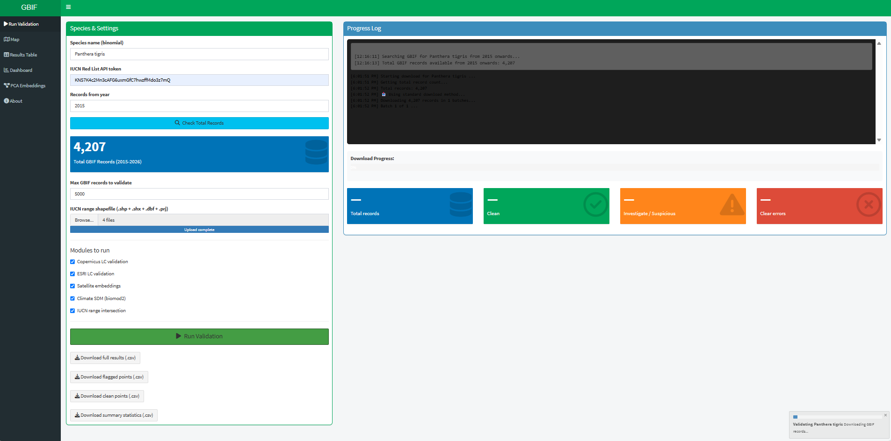
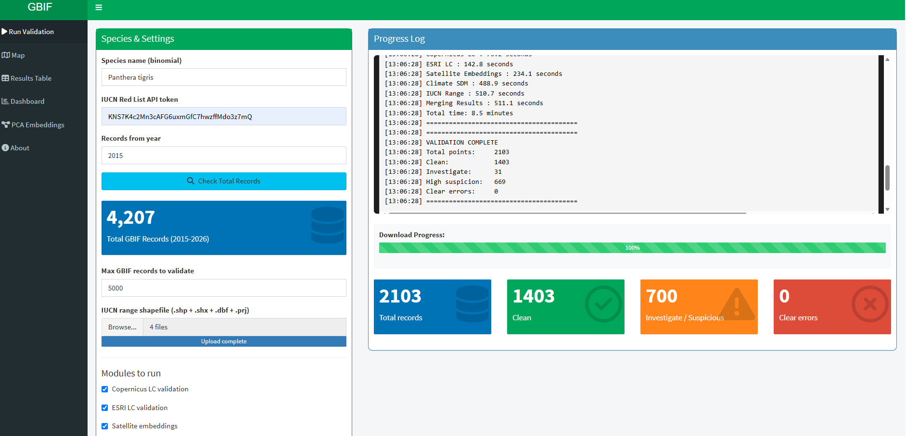
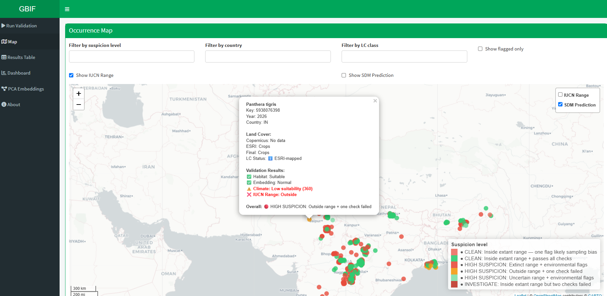
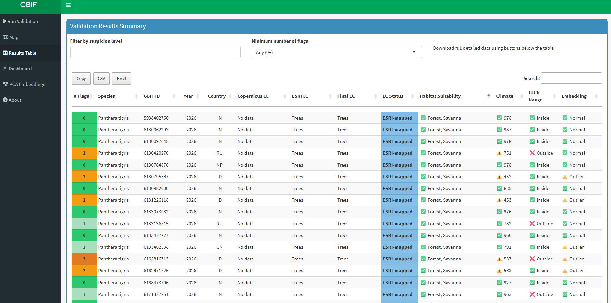
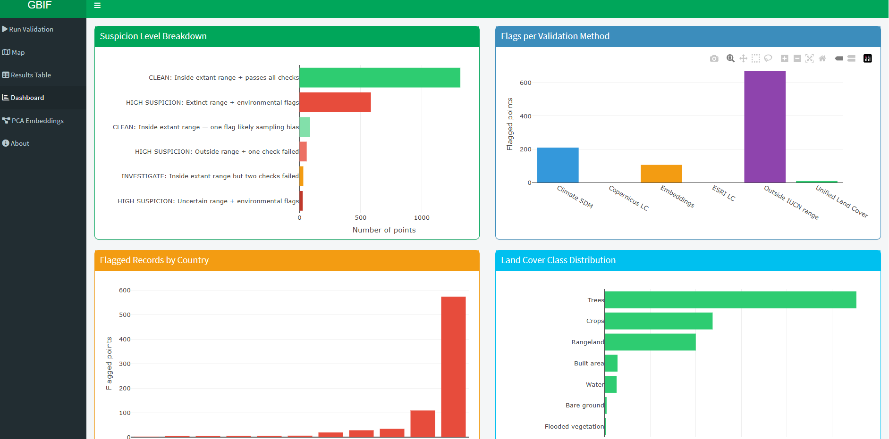
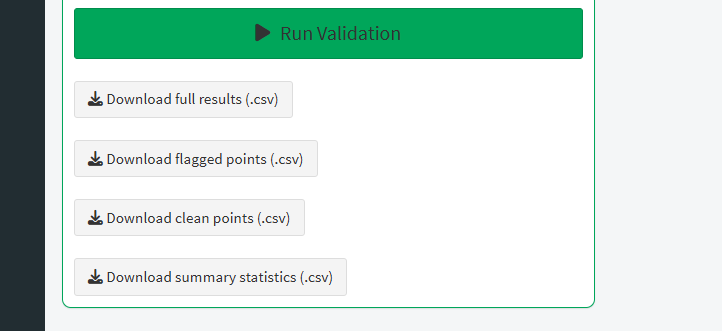
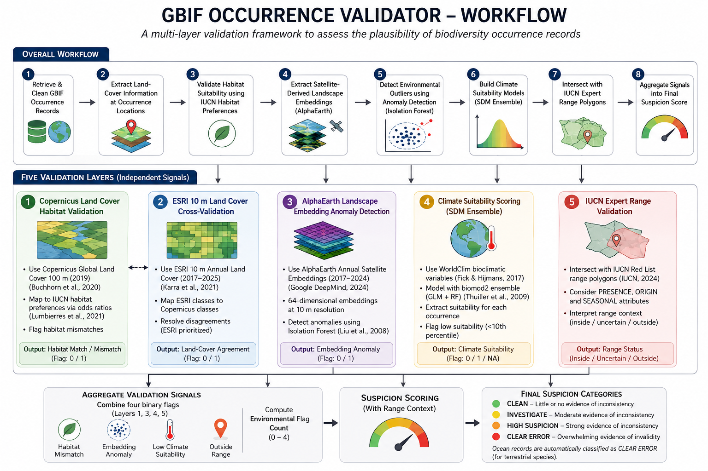

# GBIF Occurrence Validator

**GBIF Ebbe Nielsen Challenge 2026 Submission**

GBIF Occurrence Validator is an open-source R Shiny platform for validating biodiversity occurrence records from GBIF. Distributed through Docker for reproducible deployment, the tool combines ecological, environmental, and expert-driven validation methods to identify suspicious records for terrestrial bird and mammal species.

---

# Screenshots

<p align="center">
  
  
</p>

<p align="center">
  
  
</p>

<p align="center">
  
  
</p>

---

# Features

GBIF Occurrence Validator provides an automated and scalable framework for biodiversity occurrence validation.

* **Global coverage** — Supports terrestrial bird and mammal species across global geographic ranges
* **Automated workflow** — Minimal user input with fully automated species-specific validation
* **User-friendly interface** — Interactive maps, dashboards, and downloadable outputs
* **Real-time feedback** — Progress tracking and live processing logs
* **Scalable performance** — Handles large datasets (up to 100,000 records) through intelligent coarsening and batch processing

---

# Validation Framework

Occurrence records are evaluated across five complementary validation layers spanning habitat, land cover, environmental similarity, climate suitability, and expert range knowledge. Results from all layers are integrated into a unified suspicion score.

<p align="center">  </p>

---

# Tech Stack

GBIF Occurrence Validator combines biodiversity informatics, geospatial analysis, and machine learning through the following technologies:

* **R** — Core application logic and data processing
* **Shiny** — Interactive web interface
* **Docker** — Containerized deployment
* **Google Earth Engine** — Large-scale geospatial data extraction
* **Python (via reticulate)** — Earth Engine integration and ML workflows
* **GBIF API** — Species occurrence retrieval
* **IUCN Red List API** — Habitat and species metadata
* **biomod2** — Species distribution modelling
* **Isolation Forest** — Environmental anomaly detection

---

# Requirements

The following external credentials are required for full functionality and must be obtained separately by users:

* **Google Earth Engine service account credentials (JSON) [Google's official documentation](https://developers.google.com/workspace/guides/create-credentials)**
* **IUCN Red List API token (You will also need a valid IUCN Red List API token, which is entered through the application interface at runtime. Tokens can be requested free of charge at [api.iucnredlist.org](https://api.iucnredlist.org/))**
* **IUCN range map polygons of the species downloaded from www.iucnredlist.org (species profile page or spatial data download section)**
These credentials are required for:

* Copernicus land-cover extraction
* ESRI land-cover validation
* AlphaEarth embedding extraction
* IUCN habitat and range validation

---

# Quick Start (Recommended)

For the simplest setup with no manual configuration, download the complete offline package — including the Docker image, pre-cached WorldClim climate data, and launcher scripts — from Google Drive:

**[Download GBIF Occurrence Validator (Drive)](https://drive.google.com/drive/folders/1AbDRYrcFfP80LtLr3JJI-PjDOx2VBxWm?usp=drive_link)**

The Drive folder already includes the pre-built `credentials/`, `climate_cache/`, and `logs/` folders — no need to create these yourself.

After downloading:
1. Install Docker Desktop
2. Place your Google Earth Engine service account JSON file inside the existing `credentials/` folder (for guidance on creating a Google Cloud service account and generating the JSON key, see [Google's official documentation](https://developers.google.com/workspace/guides/create-credentials))
3. Double-click `launch_app.bat`

The app will open automatically at `http://localhost:3838`.

---

# Installation (From Docker Hub / Source)

## Create Required Folders

Before pulling or running the image, create the following folders in your working directory:

```bash
mkdir credentials
mkdir climate_cache
mkdir logs
```

## Pull Docker Image

```bash
docker pull prabs330/gbif-validator:latest
```

Alternatively, clone this repository and build locally:

```bash
docker build -t gbif-validator .
```

---

# Credential Setup

Place your Google Earth Engine service account JSON file inside the `credentials/` folder:

```text
credentials/
└── service-account.json
```

## Climate Data Setup

The `climate_cache/` folder must be populated with WorldClim 2.1 bioclimatic variables before the Climate SDM module will work. You can download this folder from the [Quick Start Drive package](#quick-start-recommended), download it directly via R:

```r
library(geodata)
worldclim_global(var = "bio", res = 2.5, path = "climate_cache")
```

This downloads ~1GB of data and may take several minutes depending on your connection.

---

# Running the App

```powershell
docker run -d -p 3838:3838 -v "${PWD}\credentials:/home/shiny/.config/earthengine" -v "${PWD}\climate_cache:/srv/climate_cache" -v "${PWD}\logs:/srv/logs" --name gbif-validator prabs330/gbif-validator:latest
```

Access the app at:

```text
http://localhost:3838
```

---

# Outputs

The application provides:

* Interactive occurrence maps
* Filterable validation tables
* Summary dashboards and visualizations
* Embedding-space anomaly plots
* Downloadable CSV outputs
* Record-level validation remarks and suspicion scores

---

# Repository Structure

```text
GBIF-Occurrence-Validator/
│
├── app_full.R
├── Dockerfile
├── docker-compose.yml
├── launch_app.bat
├── stop_app.bat
├── README.md
├── LICENSE
├── .gitignore
│
├── docs/
│   ├── methodology.md
│   ├── screenshots/
│   └── sample_outputs/
```

---

# Citation

If you use this tool in research or applied biodiversity workflows, please cite:

**GBIF Occurrence Validator (2026)**
Prabhat Raj Dahal

---

# References

Buchhorn, M., Smets, B., Bertels, L., De Roo, B., Lesiv, M., Tsendbazar, N. E., Herold, M., & Fritz, S. (2020). Copernicus Global Land Service: Land Cover 100 m Collection 3.

Fick, S. E., & Hijmans, R. J. (2017). WorldClim 2: New 1-km spatial resolution climate surfaces for global land areas. International Journal of Climatology, 37, 4302–4315.

Google DeepMind. (2024). AlphaEarth Foundations: Annual Satellite Embeddings.

IUCN. 2025. IUCN Red List of Threatened Species. Version 2025-2 <www.iucnredlist.org>

Karra, K., Kontgis, C., Statman-Weil, Z., Mazzariello, J. C., Mathis, M., & Brumby, S. P. (2021). Global land use / land cover with Sentinel-2 and deep learning at 10 m resolution. Scientific Data, 8, 232.

Liu, F. T., Ting, K. M., & Zhou, Z.-H. (2008). Isolation Forest. In Proceedings of the 8th IEEE International Conference on Data Mining.

Lumbierres, M., Dahal, P. R., Di Marco, M., Butchart, S. H. M., Donald, P. F., & Rondinini, C. (2021). Translating IUCN habitat classes into land-cover data to map area of habitat of terrestrial vertebrates. Conservation Biology.

Thuiller, W., Lafourcade, B., Engler, R., & Araújo, M. B. (2009). BIOMOD—A platform for ensemble forecasting of species distributions. Ecography, 32, 369–373.

Zizka, A., Silvestro, D., Andermann, T., et al. (2019). CoordinateCleaner: Standardized cleaning of occurrence records from biological collection databases. Methods in Ecology and Evolution, 10, 744–751.
