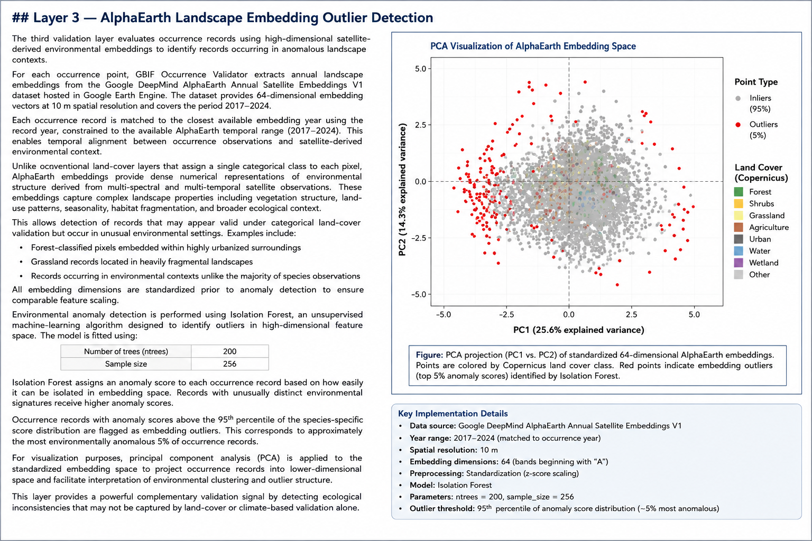

# Methodology

## Overview

GBIF Occurrence Validator uses a multi-layer validation framework to assess the plausibility of biodiversity occurrence records from GBIF. The tool integrates ecological, environmental, machine learning, and expert-derived validation methods to identify suspicious records for terrestrial bird and mammal species.

Each record is evaluated across five complementary validation layers spanning habitat suitability, land-cover consistency, environmental similarity, climate suitability, and expert range knowledge:

1. Copernicus land-cover habitat validation
2. ESRI high-resolution land-cover cross-validation
3. AlphaEarth satellite embedding anomaly detection
4. Climate suitability scoring via ensemble species distribution modelling
5. IUCN expert range validation

Each layer produces an independent validation signal, which is subsequently integrated into a unified suspicion score ranging from **CLEAN** to **CLEAR ERROR**.

The framework is intentionally conservative and designed to minimize false positives by prioritizing multi-layer agreement over isolated validation failures.

---

# Validation Workflow

The validation workflow follows the sequence below:

1. Retrieve and clean GBIF occurrence records
2. Extract land-cover information at occurrence locations
3. Validate habitat suitability using IUCN habitat preferences
4. Extract satellite-derived landscape embeddings
5. Detect environmental outliers using anomaly detection
6. Build climate suitability models using species distribution modelling
7. Intersect records with IUCN expert range polygons
8. Aggregate validation signals into final suspicion scores

---

# Layer 1 — Copernicus Land Cover Habitat Validation

The first validation layer evaluates occurrence points using the Copernicus Global Land Cover product at 100 m spatial resolution.

Each occurrence point is assigned a land-cover class and compared against species-specific habitat preferences retrieved from the IUCN Red List API via the `rredlist` package.

Habitat suitability assessment uses the translation framework developed by Lumbierres et al. (2021), which statistically links IUCN habitat classes to Copernicus land-cover classes using odds ratios derived from large occurrence datasets.

Only land-cover associations with odds-ratio values ≥ 1.743 are considered ecologically suitable. This threshold corresponds to the strongest tertile of habitat-land cover associations.

Occurrence records falling in unsuitable land-cover classes are flagged as habitat mismatches.

## Copernicus Land-Cover Classes

| Code    | Class                                           |
| ------- | ----------------------------------------------- |
| 20      | Shrubs                                          |
| 30      | Herbaceous vegetation                           |
| 40      | Cultivated and managed vegetation / Agriculture |
| 50      | Urban / built-up                                |
| 60      | Bare / sparse vegetation                        |
| 70      | Snow and ice                                    |
| 80      | Permanent water bodies                          |
| 90      | Herbaceous wetland                              |
| 100     | Moss and lichen                                 |
| 111–116 | Closed forest classes                           |
| 121–126 | Open forest classes                             |
| 200     | Ocean                                           |

---

# Layer 2 — ESRI 10 m Annual Land Cover Cross-Validation

The second validation layer refines habitat assessment using ESRI 10 m Annual Land Cover data (2017–2025), which provides substantially higher spatial resolution and more recent temporal coverage than Copernicus land cover.

This improves detection of habitat inconsistencies in fragmented landscapes, heterogeneous environments, and rapidly changing ecosystems.

ESRI land-cover classes are mapped to equivalent Copernicus classes to maintain consistency with the Layer 1 habitat validation framework.

## ESRI-to-Copernicus Crosswalk

| ESRI Class         | Equivalent Copernicus Class                      |
| ------------------ | ------------------------------------------------ |
| Trees              | Forest classes                                   |
| Rangeland          | Shrubs / Herbaceous vegetation / Moss and lichen |
| Crops              | Cultivated vegetation                            |
| Built Area         | Urban                                            |
| Bare Ground        | Bare / sparse vegetation                         |
| Snow / Ice         | Snow and ice                                     |
| Water              | Permanent water bodies                           |
| Flooded Vegetation | Herbaceous wetland                               |
| Clouds             | Not evaluated                                    |

Agreement between Copernicus and ESRI validations increases confidence in land-cover assessment.

When disagreement occurs, ESRI classification is selected as the final land-cover decision due to its finer spatial resolution and more recent temporal coverage.

---

# Layer 3 — AlphaEarth Landscape Embedding Outlier Detection

The third validation layer evaluates occurrence records using high-dimensional satellite-derived environmental embeddings.

For each occurrence point, annual embeddings are extracted from Google DeepMind AlphaEarth Annual Satellite Embeddings V1 using Google Earth Engine.

The dataset provides 64-dimensional embedding vectors at 10 m spatial resolution and covers the years 2017–2024.

Each occurrence record is assigned the closest available embedding year based on its observation year.

Unlike conventional land-cover products, AlphaEarth embeddings capture rich environmental information derived from multi-spectral and multi-temporal satellite observations, including:

* Vegetation structure
* Habitat fragmentation
* Land-use patterns
* Seasonality
* Landscape heterogeneity

All embedding dimensions are standardized prior to anomaly detection.

Environmental anomaly detection is performed using Isolation Forest.

## Isolation Forest Parameters

* Number of trees = 200
* Sample size = 256

Each record receives an anomaly score.

Records with anomaly scores above the 95th percentile of the species-specific anomaly score distribution are flagged as environmental outliers.

This corresponds approximately to the most anomalous 5% of occurrence records.

Principal Component Analysis (PCA) is used for visualization of embedding structure and anomaly clusters.

**Figure.** PCA projection of standardized 64-dimensional AlphaEarth embeddings. Highlighted points represent occurrence records flagged as environmental outliers by Isolation Forest.

---

# Layer 4 — Climate Suitability Scoring via Ensemble Species Distribution Modelling

The fourth validation layer evaluates whether occurrence records occur within climatically suitable environmental conditions.

Climate suitability modelling is implemented using `biomod2` and WorldClim bioclimatic variables.

## Climate Data Preparation

WorldClim bioclimatic variables are retrieved at 2.5 arc-minute resolution.

Climate layers are cropped to the species occurrence extent with an additional 2-degree buffer in all directions.

To reduce multicollinearity among predictors, pairwise Pearson correlation is computed across climate variables.

Predictors are iteratively selected such that no retained variable has an absolute correlation coefficient greater than 0.7.

This produces a reduced set of non-collinear climate predictors for model fitting.

## Model Training

To improve computational efficiency, SDM training is performed using a coarsened occurrence dataset rather than all raw occurrence points.

Presence-only modelling is performed using randomly generated pseudo-absences.

### Pseudo-absence Parameters

* Replicates = 2
* Number of pseudo-absences = number of occurrences
* Strategy = random

Two modelling algorithms are used:

* Generalized Linear Model (GLM)
* Random Forest (RF)

### Model Parameters

* Replicates = 2
* Training split = 80%
* Validation split = 20%
* Evaluation metrics = TSS and ROC
* Random seed = 42

## Ensemble Forecasting

Individual models are combined using ensemble modelling.

### Ensemble Parameters

* Ensemble algorithm = EMmean
* Selection metric = TSS
* TSS threshold = 0.4

Continuous suitability predictions are generated across the modelling extent.

## Record-Level Suitability Assessment

After model fitting, climate suitability values are extracted for all occurrence records in the full dataset.

Each record receives a continuous suitability score representing predicted climatic suitability.

Records with suitability values below the 10th percentile of the species-specific suitability distribution are flagged as climatically suspicious.

Records with missing suitability values are retained and labelled as unknown.

---

# Layer 5 — IUCN Expert Range Validation

The fifth validation layer evaluates occurrence records against expert-derived species range polygons from the IUCN Red List.

Unlike environmental validation layers, this component uses expert-curated geographic range boundaries to assess whether records fall within known species distributions.

## Range Data Input

Users may optionally upload IUCN species range shapefiles.

Supported polygon attributes include:

* `PRESENCE`
* `ORIGIN`
* `SEASONAL`

Occurrence points are spatially intersected with uploaded polygons using point-in-polygon analysis.

If multiple polygons overlap, the highest-priority polygon is retained.

## IUCN Presence Categories

| Code | Interpretation            |
| ---- | ------------------------- |
| 1    | Extant                    |
| 2    | Probably Extant           |
| 3    | Possibly Extant           |
| 4    | Possibly Extinct          |
| 5    | Extinct                   |
| 6    | Presence Uncertain        |
| 7    | Expected Additional Range |

## Origin Categories

| Code | Interpretation        |
| ---- | --------------------- |
| 1    | Native                |
| 2    | Reintroduced          |
| 3    | Introduced            |
| 4    | Vagrant               |
| 5    | Origin Uncertain      |
| 6    | Assisted Colonisation |

## Seasonal Categories

| Code | Interpretation     |
| ---- | ------------------ |
| 1    | Resident           |
| 2    | Breeding           |
| 3    | Non-breeding       |
| 4    | Passage            |
| 5    | Seasonal Uncertain |

Records are interpreted using combined presence, origin, and seasonal status rather than simple inside/outside classification.

This enables more nuanced validation of range plausibility.

---

# Suspicion Score Aggregation

Validation outputs from all layers are combined into a unified suspicion score.

The final environmental flag count is computed from four binary validation signals:

* Habitat validation failure
* AlphaEarth embedding anomaly
* Climate suitability failure
* Outside IUCN range

Higher flag counts indicate stronger evidence of suspicious records.

## Special Rules

### Ocean Records

Occurrence records located in ocean land-cover classes are automatically classified as:

**CLEAR ERROR**

These represent biologically impossible locations for terrestrial species.

### Range Context

IUCN range status strongly influences final scoring.

The same number of environmental flags may result in different suspicion levels depending on whether a record falls inside extant range, uncertain range, extinct range, or outside all known range polygons.

---

# Final Suspicion Categories

## CLEAN

Records with little or no evidence of inconsistency.

Examples:

* Inside extant range and passes all checks
* Inside extant range with one isolated validation failure

## INVESTIGATE

Records with moderate evidence of inconsistency.

Examples:

* Two failed validation layers
* Presence uncertain polygons
* Extinct range with no additional flags

## HIGH SUSPICION

Records with strong evidence of inconsistency.

Examples:

* Outside range with environmental validation failures
* Extinct range with additional anomalies
* Multiple failed validation layers

## CLEAR ERROR

Records with overwhelming evidence of invalidity.

Examples:

* Ocean locations
* Outside range with multiple failed validation layers
* Severe multi-layer ecological inconsistency

---

# Performance Optimization

GBIF Occurrence Validator is designed to support large-scale biodiversity datasets while maintaining practical runtime and memory efficiency.

Several optimizations improve scalability:

## Intelligent Spatial Coarsening

Computationally intensive steps such as climate suitability modelling use spatially coarsened occurrence data during model training.

Final validation scores are always computed on the full dataset.

## Batch Processing

Satellite embedding extraction and Earth Engine operations are processed in batches to reduce memory overhead and improve runtime.

## Selective Resolution Usage

Different spatial datasets are used according to computational requirements:

* Copernicus Land Cover (100 m)
* ESRI Land Cover (10 m)
* WorldClim climate layers (2.5 arc-minute)

This balances ecological detail and computational efficiency.

The platform supports datasets containing up to approximately 100,000 occurrence records.

---

# Limitations

Despite its multi-layer design, the validator has several limitations.

## Taxonomic Scope

The current implementation supports terrestrial bird and mammal species only.

## Dependence on External Datasets

Validation quality depends on the quality and completeness of external datasets including land cover, climate layers, satellite embeddings, and IUCN range polygons.

## Ecological Complexity

Rare dispersal events, seasonal movements, sink populations, and poorly sampled populations may generate valid records that appear anomalous.

## Conservative Interpretation Required

Validation outputs should be interpreted as decision-support signals rather than definitive proof of validity or invalidity.

Suspicious records should be prioritized for expert review rather than automatically discarded.

---

# References

Lumbierres, M., Dahal, P. R., Di Marco, M., Butchart, S. H. M., Donald, P. F., & Rondinini, C. (2021). Translating IUCN habitat classes into land-cover data to map area of habitat of terrestrial vertebrates. *Conservation Biology*.

GBIF.org — Global Biodiversity Information Facility.

IUCN Red List of Threatened Species.

WorldClim Version 2.

Google Earth Engine.

Google DeepMind AlphaEarth Satellite Embeddings.

biomod2 R Package.

Isolation Forest.
